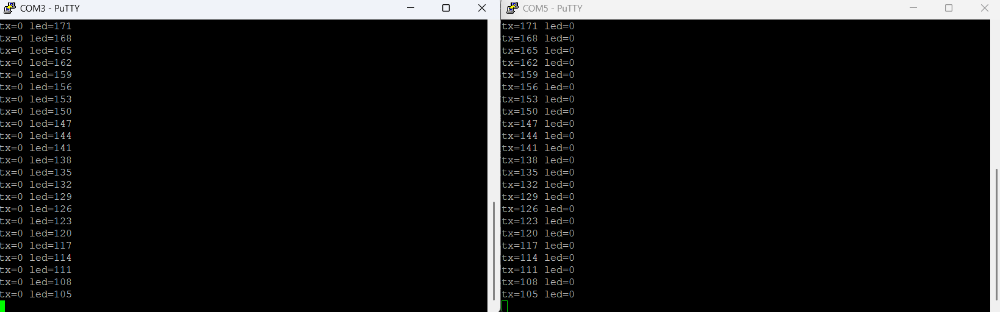

# CAN Bus Distributed Control (STM32, Bare-Metal)

A two-node distributed control system on STM32F103 microcontrollers, written in bare-metal C. One node transmits a control value over a CAN bus and the second node receives it and drives an actuator, with live telemetry from both over UART.

**Tech Stack -**
C (bare-metal, register-level), STM32F103 (ARM Cortex-M3), bxCAN, SN65HVD230 CAN transceivers, I2C/USART/TIM/PWM peripherals, ST-Link, PuTTY, Saleae logic analyzer.


## What it Does
The two STM32 boards talk to each other over a real CAN bus. Node A generates a value that ramps up and down and transmits it as a CAN frame every tick. Node B receives the frame and uses the value to set an LED's brightness through software PWM, so the light visibly "breathes" in sync with the number crossing the wire. Both nodes stream what they're doing over UART, so you can watch `tx=` on the sender and `led=` tracking it on the receiver.




## Inspiration and Backstory
I wanted a project that made me write bare-metal C instead of leaning on frameworks. I wanted to target CAN, since it's the backbone of many automotive and industrial systems, and writing a driver for it from the register level up helped me learn and understand clocks, bit timing, GPIO alternate functions, and interrupts rather than calling a library with something like an Arduino microcontroller.

The original plan was a self-leveling platform with a DC motor and an IMU. That turned into a much longer hardware debugging journey than expected (see below). I pivoted the actuator to a simple LED and made the distributed CAN architecture the core of the project, since I had that working reliably.


## How I Built It

**Bare-metal drivers.**
Everything is written by reading and writing peripheral registers directly through pointer-mapped defines. GPIO, USART (9600 8N1 for telemetry), TIM2 as a periodic interrupt tick, software PWM for the LED actuator, and the bxCAN peripheral itself.

**CAN configuration.**
The CAN driver sets bit timing for 500 kbit/s off the 8 MHz peripheral clock, configures an acceptance filter to pass all frames into FIFO0, and handles transmit and receive through mailbox and FIFO registers.

**Loopback-first bring-up.**
Before depending on wiring, I validated the CAN peripheral using its internal loopback mode. This is where the chip transmits a frame and receives its own frame with no transceiver and no second board. Getting a frame to loop back and print over UART proved the entire peripheral config in isolation, so that when I moved to two physical nodes, the only new variable was the bus wiring.

**Two-node split.**
A single source file builds all three roles. Sender, receiver, or single-board loopback which is selected by one compile-time define. On the two-board bus, each Blue Pill drives an SN65HVD230 transceiver, and the transceivers share a CANH/CANL pair plus a common ground.

**Timeouts everywhere.**
Whenever the code waits on a hardware flag, a spin counter limits how long it spins, so a stalled or absent peripheral can never freeze the whole program. It instead reports and moves on. This came directly out of a debugging session where an unbounded wait hung the firmware silently.


## Wiring

**Each Blue Pill to its SN65HVD230 transceiver:**

| Blue Pill | Transceiver |
|-----------|-------------|
| PA12      | CAN TX      |
| PA11      | CAN RX      |
| 3V3       | 3V3         |
| GND       | GND         |

**The bus (transceiver A to transceiver B):**

| Node A          | Node B          |
|-----------------|-----------------|
| CANH            | CANH            |
| CANL            | CANL            |
| GND             | GND             |

**UART telemetry (each Blue Pill to a USB-serial adapter):**

| Blue Pill | Adapter |
|-----------|---------|
| PA9 (TX)  | RXD     |
| PA10 (RX) | TXD     |
| GND       | GND     |
| 3V3       | 3V3     |


## Building
Set the role in main.c and flash one board as each:

```c
/* #define ROLE_LOOPBACK */   /* single board, CAN internal loopback */
#define ROLE_NODE_A           /* sender            */
/* #define ROLE_NODE_B */     /* receiver + LED    */
```

First, I flashed the boards with an ST-Link. Then I opened both serial ports at 9600 baud. Node A then prints `tx=` counting up and down. Node B prints `led=` tracking those values as its LED breathes.


## Challenges I Ran Into
A lot of this project's learning came from hardware faults, not code surprisingly.

**A dead motor that wasn't the motor.** The original DC-motor actuator refused to spin. I traced the signal chain pin by pin using a logic analyzer and found the problem was in several places. There were multiple dead jumper wires from what I assume was a low-quality pack, a control line landing one hole off, and a driver-enable pin that had gotten loose. Each one individually produced the same symptom of "dead motor", so the only way through was methodical isolation by confirming each signal at the chip one by one.

**A peripheral that hung the whole program.** There was an unbounded `while` loop waiting on a hardware flag that froze the firmware with no output when a peripheral didn't respond. The fix was to bound every wait with a spin counter and have failures report a status code instead of nothing. This is now a design principle throughout the codebase as a result.

**Reset and power-cycle confusion.** Because the two boards shared a power rail through the bus, one board back-powered the other, so resets didn't always take effect and boot messages were easy to miss or just outright didn't show up. I had to learn to reason about shared grounds and actual power state rather than assuming a reset happened.


## What I Learned
- Reading a microcontroller reference manual and configuring peripherals from raw registers.
- How CAN works at the physical and protocol level - bit timing, differential signaling, transceivers, termination, acknowledgment.
- Validating each layer in isolation (loopback before bus) instead of wiring everything and debugging the whole stack at once.
- Debugging real hardware with a logic analyzer, and writing defensive firmware that fails with debug messages instead of showing nothing.


## Future Work
I do want to continue building upon this project when I get more time. Below is a list of things I'd like to implement into the system.

- **IMU-driven closed-loop control** - replace Node A's ramp with real tilt data from an MPU-6050 over I2C, run a PID loop, and transmit the correction. The I2C driver is written, but I need to integrate it in.
- **Fault-tolerant safe-state** - heartbeat frames and a receive timeout on Node B, so the actuator drops to a defined safe state if the bus goes silent.
- **Multi-byte CAN payloads** and multiple message IDs for a richer distributed protocol.
- **Retrying finetuned motor control** - Possibly reattempting to wire and get the motor to spin and work with the code would be nice, but I expect this will be the most time consuming item.
- **Self-Stabilizing platform**- Potentially (if motor is properly working) using it to create a self-leveling platform to then integrate into a larger system?